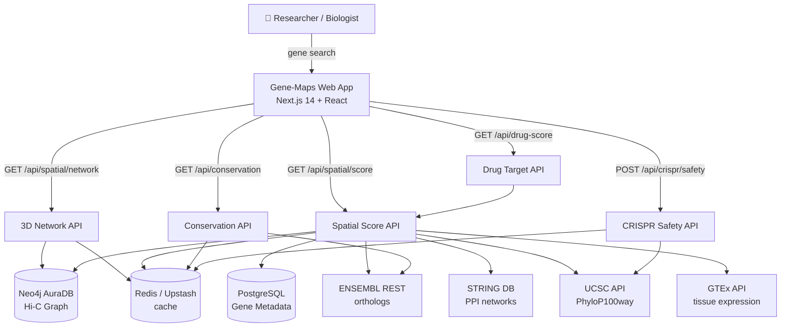
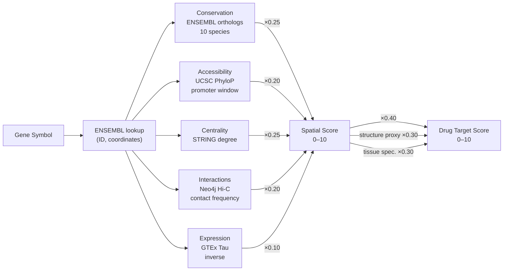

# Gene-Maps : Spatial Pharmacogenomics Platform

> **Map your gene's address in 3D space. Discover what makes it druggable.**

[](https://nextjs.org)
[](https://www.typescriptlang.org)
[](https://neo4j.com/cloud/platform/aura-graph-database)
[](https://vercel.com)
[](#)

---

## What is Gene-Maps?

The human genome is not a flat list of genes — it folds into an intricate 3D architecture inside the nucleus. Where a gene sits in this 3D space determines which enhancers switch it on, which proteins it interacts with, and whether it can be safely targeted by a drug or a gene editor.

**Gene-Maps** translates this 3D genome science into an accessible research tool. Search any human gene and instantly explore its spatial context: how it interacts with neighbours in chromatin space, how conserved its sequence is across evolution, how risky a CRISPR edit would be at a given position, and how druggable it looks from a spatial genomics perspective.

---

## What it does

```
┌─────────────────────────────────────────────────────────────────────┐
│  Search gene  →  3D Network  →  Spatial Score  →  Conservation     │
│                            ↘  CRISPR Safety  →  Drug Target Score  │
└─────────────────────────────────────────────────────────────────────┘
```

| Feature | Data source | Output |
|---------|------------|--------|
| **3D Spatial Network** | Hi-C (pre-computed) | Interactive graph of chromatin contacts |
| **Spatial Score** | ENSEMBL · STRING · UCSC · GTEx | Composite 0–10 druggability index |
| **Cross-species Conservation** | ENSEMBL REST API | Ortholog % identity across 10 species |
| **CRISPR Safety** | UCSC ENCODE CTCF · PhyloP100way | TAD disruption risk + conservation constraint |
| **Drug Target Score** | All sources combined | Weighted druggability assessment |

---

## Feature deep-dives — for biologists

### 1. 3D Spatial Network

**What is it?**
Chromosomes are not stretched out in the nucleus — they are folded into loops and domains. Hi-C sequencing captures which genomic regions physically touch each other in 3D space by crosslinking chromatin, cutting with restriction enzymes, and sequencing the ligated fragments. Each contact frequency tells us how often two loci are in the same spatial neighbourhood.

**What does Gene-Maps show?**
An interactive force-directed graph (D3.js) where:
- Each **node** is a gene; size encodes its spatial score
- Each **edge** is a Hi-C contact; thickness encodes contact frequency
- **Colour** groups genes by pathway/cluster

**Why it matters for drug discovery:**
Genes that are spatially co-localised often share regulatory elements (enhancers, transcription factor binding sites). A drug that perturbs one gene may therefore affect its spatial neighbours — this network reveals those hidden dependencies before you commit to a target.

---

### 2. Spatial Score (composite index, 0–10)

**What is it?**
A single number summarising how "3D-privileged" a gene is — integrating five independent biological dimensions into one weighted score.

```
Spatial Score =
  0.25 × Conservation score      (evolutionary constraint, 10 species)
  0.20 × Chromatin accessibility  (UCSC PhyloP100way at promoter)
  0.25 × Network centrality       (STRING PPI degree centrality)
  0.20 × Hi-C interaction strength(average contact frequency, top 10 neighbours)
  0.10 × Expression plasticity    (inverse of GTEx Tau specificity index)
```

**Each component explained:**

| Component | What it measures | Why it matters |
|-----------|-----------------|----------------|
| **Conservation** | How identical the protein sequence is in mouse, rat, dog, pig, cow, chicken, frog, zebrafish, fruit fly, nematode | Highly conserved = essential function = likely druggable without species barrier |
| **Chromatin accessibility** | PhyloP100way score at the gene promoter — proxy for open chromatin | Open chromatin = transcription factor binding = gene is actively regulated and reachable |
| **Network centrality** | Degree centrality in the STRING protein-protein interaction network | Hub proteins (high degree) are disease-relevant and often have accessible binding pockets |
| **Hi-C contacts** | Average normalised contact frequency with spatial neighbours | High contact = stable spatial co-localisation with regulatory machinery |
| **Expression plasticity** | Inverse of tissue specificity (Tau index from GTEx) | Broadly expressed genes are more likely to have a druggable phenotype in multiple tissue contexts |

**Interpretation:**
- **≥ 7.0** — Spatially privileged. Strong candidate for drug target or functional study.
- **4.0–6.9** — Moderate. Follow up with experimental validation of specific components.
- **< 4.0** — Spatially isolated or rapidly evolving. De-prioritise without orthogonal evidence.

---

### 3. Cross-Species Conservation

**What is it?**
Evolution is the best functional screen ever run. If a gene has been conserved essentially unchanged over hundreds of millions of years across vertebrates and invertebrates, natural selection has been acting to preserve it — meaning every nucleotide matters.

**How it's calculated:**
Gene-Maps queries the **ENSEMBL REST API** for the ortholog (evolutionary equivalent gene) of your target in each of 10 model organisms. The percent amino acid identity of the best ortholog alignment is returned for each species. A weighted average (closer species weighted more heavily) produces the summary conservation score.

**Species panel and evolutionary distances:**
```
Human (query)
├── Mouse        ~75 Mya divergence  — weight 0.90
├── Rat          ~75 Mya             — weight 0.88
├── Dog          ~95 Mya             — weight 0.82
├── Pig          ~95 Mya             — weight 0.80
├── Cow          ~95 Mya             — weight 0.78
├── Chicken      ~310 Mya            — weight 0.60
├── Frog         ~360 Mya            — weight 0.45
├── Zebrafish    ~450 Mya            — weight 0.40
├── Fruit fly    ~800 Mya            — weight 0.25
└── Nematode     ~900 Mya            — weight 0.15
```
*(Mya = million years ago)*

**Biological interpretation:**
- **> 80% average** — Deeply conserved (e.g., TP53, EGFR). Likely an ancient, essential function. Animal models will be faithful.
- **50–80%** — Moderately conserved. Some vertebrate-specific adaptations.
- **< 50%** — Rapidly evolving or lineage-specific. Animal model caution required.

---

### 4. CRISPR Safety Assessment

**What is it?**
CRISPR-Cas9 is a programmable DNA scissors: a guide RNA directs Cas9 to cut at a specific genomic position. But the genome is 3D — a cut near a *Topologically Associating Domain (TAD) boundary* can scramble the regulatory landscape for dozens of genes simultaneously, even if the cut looks safe on a linear genome map.

**What is a TAD?**
TADs are megabase-scale chromatin domains that insulate genes from enhancers in neighbouring domains. The boundaries between TADs are marked by clusters of CTCF protein binding sites. When a TAD boundary is disrupted, ectopic enhancer–gene contacts form, causing aberrant gene expression that mimics developmental disease (Lupiáñez et al. 2015 *Cell*).

**How Gene-Maps calculates risk:**

```
Step 1: Query UCSC ENCODE clustered CTCF track
        in a ±50 kb window around the edit site
        → High CTCF density = near a TAD boundary

Step 2: Convert CTCF count to deterministic boundary distance
        ≥15 CTCF sites → ~8 kb from boundary  (very high risk)
         8–14 sites    → 15–50 kb             (high risk)
         3–7 sites     → 50–150 kb            (moderate)
         0–2 sites     → 150–500 kb           (low risk)

Step 3: Boundary strength = min(CTCF_count / 15, 1.0)

Step 4: TAD disruption risk = distance_decay × boundary_strength × 10
        (distance decays linearly to 0 at 200 kb)

Step 5: Conservation constraint = UCSC PhyloP100way score
        in a ±100 bp window at the exact edit position
        High PhyloP → recommend base/prime editing over Cas9 DSB

Step 6: Off-target risk = f(Hi-C neighbour count, avg confidence)

Step 7: Safety score = 10 − (0.6 × TAD_risk + 0.4 × off_target_risk)
```

**All calculations are fully deterministic** — the same input position always produces the same result, making assessments reproducible across experiments.

**Safety score guide:**
- **≥ 7** — Proceed with standard SpCas9. Run amplicon sequencing to confirm.
- **4–6** — Proceed cautiously. Validate with 4C-seq. Monitor flanking genes.
- **< 4** — High risk. Consider dCas9 (CRISPRi/a), base editing, or prime editing.

---

### 5. Drug Target Score

**What is it?**
Not every gene with a known disease association is druggable. A drug target must have a physically accessible binding pocket, be expressed in the right tissue, and be tractable to modulation. Gene-Maps synthesises the spatial data into a single druggability estimate.

**How it's calculated:**
```
Druggability = 0.40 × Spatial Score
             + 0.30 × Structural features proxy
             + 0.30 × Tissue specificity score

Structural features = Spatial Score × 0.6 + PPI interaction density × 0.4
  (proxy for pocket accessibility — conserved, well-connected proteins
   tend to have defined structural domains)

Tissue specificity  = GTEx Tau index (0 = ubiquitous, 1 = highly specific)
  (tissue-specific targets reduce off-tissue toxicity risk)
```

**Drug class inference:**
Gene-Maps cross-references high-confidence STRING interaction partners to infer likely drug modality (kinase inhibitor, monoclonal antibody, small molecule), giving the chemist an early signal on therapeutic strategy.

---

## Expected results and outcomes

When you search a gene in Gene-Maps, you should expect:

### For a well-characterised drug target (e.g. EGFR, KRAS, TP53)
- **Spatial Score 7–9**: high conservation, dense PPI network, strong Hi-C contacts with known oncogene neighbourhoods
- **Conservation**: > 85% across vertebrates, clear orthologs in all 10 species
- **CRISPR Safety**: variable — EGFR edits in exon regions show moderate TAD risk; intronic edits score safer
- **Drug Target Score 7–9**: confirms existing clinical evidence programmatically

### For a neurological gene (e.g. APP, SNCA, MAPT)
- **Spatial Score 5–7**: high conservation but moderate network centrality (brain-specific expression limits STRING coverage)
- **Conservation**: very high in mammals (> 90%), drops sharply in invertebrates
- **CRISPR Safety**: depends strongly on edit position — promoter edits near CTCF clusters score high risk
- **Drug Target Score 5–7**: moderate, reflecting difficulty of CNS target access

### For a newly implicated GWAS locus (e.g. FTO, SORT1)
- **Spatial Score 4–6**: reveals whether the gene is a spatial hub or an isolated bystander
- **Conservation**: intermediate — GWAS loci often show lineage-specific selection
- **Network**: identifies spatially co-regulated genes that may be the actual effectors of the GWAS signal

### What Gene-Maps will NOT tell you
- Exact 3D coordinates (requires experimental Hi-C at cell-type resolution)
- Clinical efficacy or toxicity predictions
- Whether a specific small molecule will bind
- Population-level variant effects (use gnomAD/ClinVar for those)

---

## Why Gene-Maps is different

### The gap it fills

Most existing tools treat the genome as a 1D sequence:

| Tool | What it does | What it misses |
|------|-------------|----------------|
| ENSEMBL / UCSC | Gene annotation, sequence | 3D spatial context |
| STRING | PPI networks | Chromatin topology |
| gnomAD | Variant constraint | Spatial neighbourhood effects |
| DGIdb | Drug–gene interactions | Why a target is spatially druggable |
| JASPAR / ENCODE | Regulatory elements | How elements cluster in 3D |
| OpenTargets | Target–disease associations | Spatial genomic risk stratification |

### Gene-Maps' unique contributions

**1. Multi-source spatial integration in one place**
No other public tool combines Hi-C contact data, ENSEMBL ortholog conservation, UCSC PhyloP base-level constraint, STRING network centrality, and GTEx tissue expression into a single ranked score. Researchers currently have to query 5+ databases manually and integrate results by hand.

**2. Biologically grounded CRISPR risk, not just sequence similarity**
Most CRISPR off-target tools (CRISPOR, Cas-OFFinder) look only at guide RNA sequence similarity. Gene-Maps adds the *spatial* off-target dimension: which genes are in the same 3D neighbourhood and could be collaterally affected by TAD boundary disruption — a mechanism documented to cause pathogenic rewiring (Lupiáñez et al. 2015).

**3. Deterministic, reproducible scoring**
All calculations use real database queries or deterministic tier-based heuristics — no random seeds, no probabilistic black boxes. The same input always produces the same output, essential for reproducibility in scientific work.

**4. Consumer-friendly interface for bench biologists**
Spatial genomics tools (Juicebox, HiGlass, cooltools) are designed for computational biologists. Gene-Maps is designed for bench scientists who need spatial context but cannot write Python or wrangle `.hic` files. Search a gene, read the results, make decisions.

**5. Evolutionary distance weighting in conservation**
Existing conservation tools (PhyloP, GERP) report per-base scores but do not aggregate into a biologically interpreted gene-level conservation profile with species-specific breakdown. Gene-Maps weights each species by evolutionary distance to human, providing an intuitive species-by-species conservation card.

**6. Open, free, fully documented**
All data sources are free public APIs. No paywalls, no institutional subscriptions, no data download required. The scoring formulas and their biological rationale are fully documented in the codebase and this README — not in a black-box model.

---

## Architecture diagram



## Scoring pipeline



---

## Quick start

### Prerequisites
- Node.js 18+
- Free accounts at: [Neo4j AuraDB](https://console.neo4j.io), [Neon.tech](https://neon.tech), [Upstash](https://upstash.com)

### 1. Clone and install
```bash
git clone <repo-url> gene_maps
cd gene_maps
npm install
```

### 2. Configure environment
```bash
cp .env.example .env.local
# Edit .env.local — fill in Neo4j, PostgreSQL, and Upstash credentials
# (see .env.example for where to find each value)
```

### 3. Apply PostgreSQL schema
Copy and run [`lib/database/schema.sql`](./lib/database/schema.sql) in your Neon SQL editor.

### 4. Validate before seeding (required)
```bash
npm run db:validate    # Neo4j + PostgreSQL + Redis
npm run api:validate   # ENSEMBL, UCSC, GTEx, STRING
```
Both must pass before seeding. The seed script aborts immediately if any required API or DB is unreachable.

### 5. Seed 50 target genes
```bash
npm run db:seed
# ~2 min (ENSEMBL rate-limited to 60 req/min)
```

### 6. Run
```bash
npm run dev        # http://localhost:3000
npm test           # Jest test suite
npm run build      # Production build
```

---

## 50 target genes

| Category | Genes |
|----------|-------|
| Drug targets (12) | GCG, EGFR, ERBB2, BRAF, ALK, JAK2, VEGFA, TNF, LDLR, CFTR, HTT, APOE |
| Cancer drivers (15) | MYC, TP53, BRCA1, BRCA2, KRAS, PIK3CA, PTEN, RB1, APC, VHL, IDH1, NF1, CDKN2A, MDM2, CCND1 |
| Neurological (12) | APP, PSEN1, PSEN2, MAPT, SNCA, LRRK2, SOD1, FUS, C9orf72, DISC1, CACNA1C, COMT |
| Metabolic (8) | INS, INSR, LEP, POMC, PPARG, HNF4A, SORT1, FTO |
| Immune (3) | IL6, CTLA4, CD274 |

---

## Available scripts

```bash
npm run dev             # Development server (http://localhost:3000)
npm run build           # Production build
npm run test            # Jest tests
npm run test:coverage   # Coverage report
npm run db:validate     # Test database connections
npm run api:validate    # Test external API connectivity
npm run db:seed         # Seed 50 genes into Neo4j + PostgreSQL
```

---

## Deployment (Vercel)

```bash
npm install -g vercel

# Add secrets (one-time setup)
vercel env add NEO4J_URI
vercel env add NEO4J_USER
vercel env add NEO4J_PASSWORD
vercel env add DATABASE_URL
vercel env add UPSTASH_REDIS_REST_URL
vercel env add UPSTASH_REDIS_REST_TOKEN

vercel --prod
```

---

## Scientific references

1. Dixon JR et al. (2012) Topological domains in mammalian genomes identified by analysis of chromatin interactions. *Nature* **485**:376–380
2. Lupiáñez DG et al. (2015) Disruptions of topological chromatin domains cause pathogenic rewiring of gene-enhancer interactions. *Cell* **161**:1012–1025
3. Rao SS et al. (2014) A 3D map of the human genome at kilobase resolution reveals principles of chromatin looping. *Cell* **159**:1665–1680
4. Pollard KS et al. (2010) Detection of nonneutral substitution rates on mammalian phylogenies. *Genome Research* **20**:110–121
5. Finan C et al. (2017) The druggable genome and support for target identification and validation in drug development. *Science Translational Medicine* **9**:eaag1166
6. GTEx Consortium (2020) The GTEx Consortium atlas of genetic regulatory effects across human tissues. *Science* **369**:1318–1330
7. Schmitt AD et al. (2016) A compendium of chromatin contact maps reveals spatially active regions in the human genome. *Cell Reports* **17**:2042–2059
